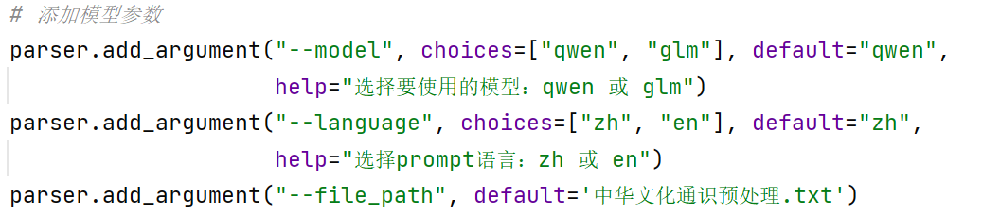
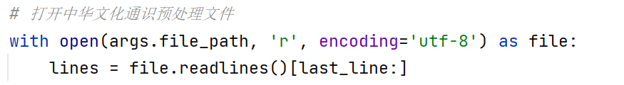
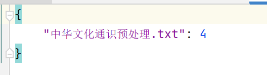
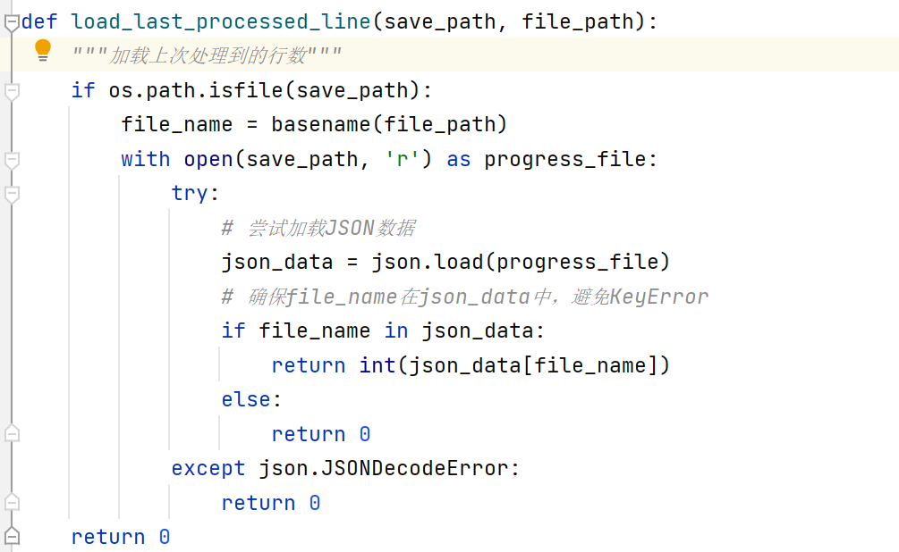
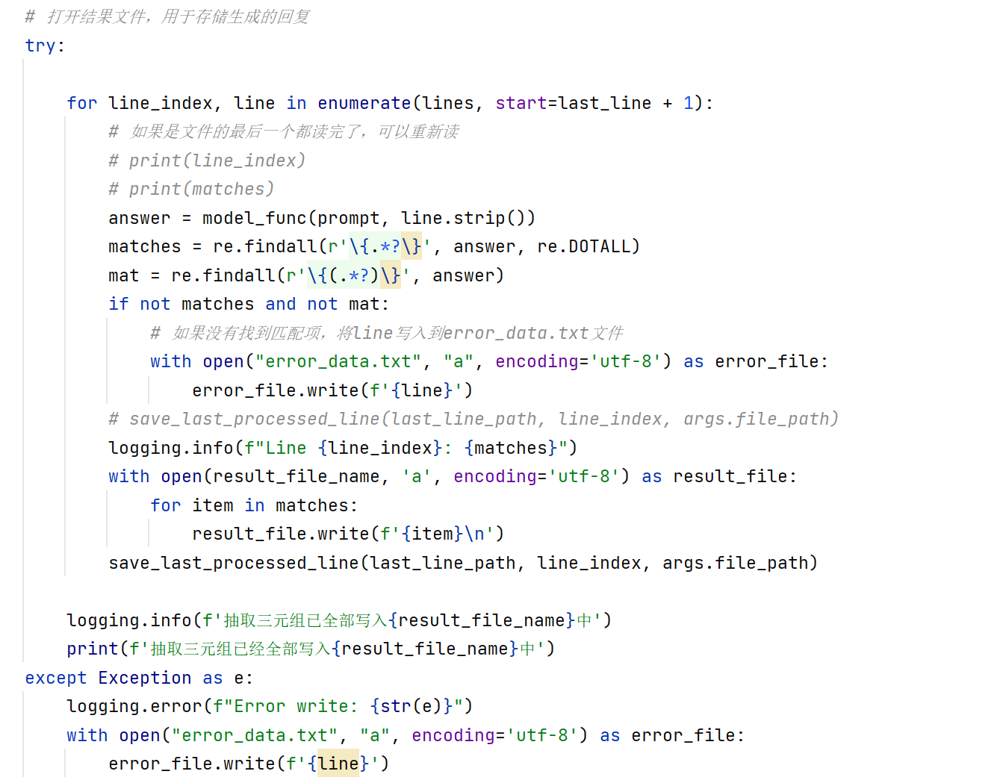
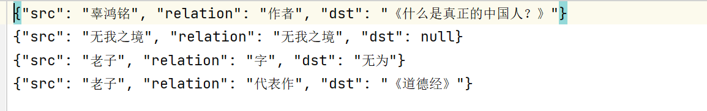
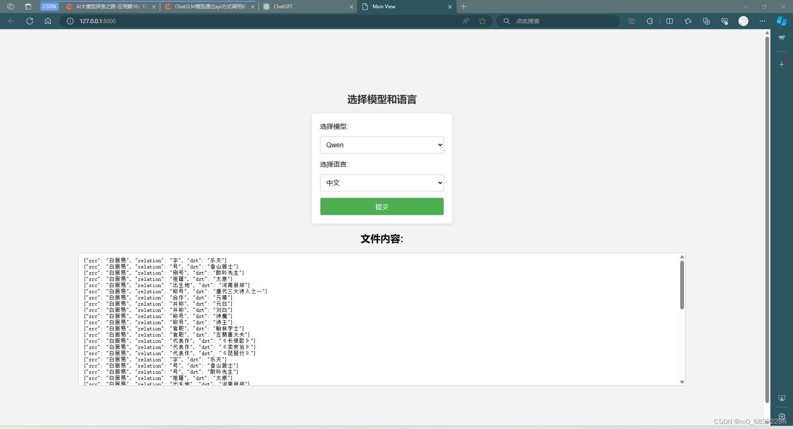
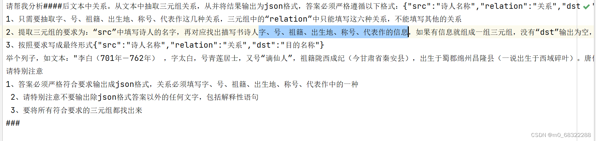
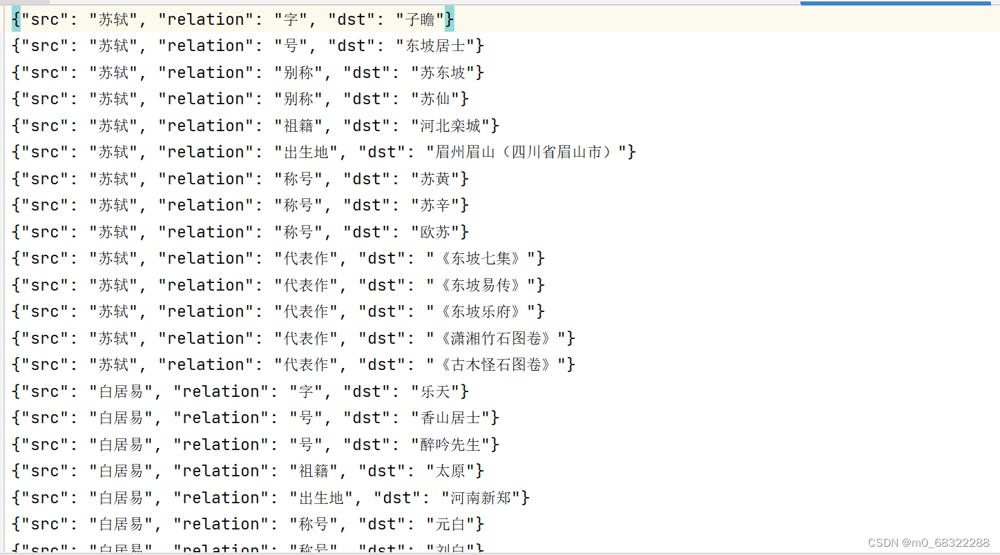

**Languages: [English](README_en.md)|[中文](README.md)**

# 任务基本要求（每一个⭐️=10分）：

1. [Remote LLM 测试 ⭐️⭐️]      自己准备不少于3个例子，在远程大模型上测试。
2. [Local LLM 测试效果  ⭐️⭐️]   自己准备不少于3个例子（保持同上），在本地大模型上测试。
3. [Local LLM 部署情况 ⭐️]      检查是否已经在本地部署了大模型
4. [Local LLM 应用开发 ⭐⭐️⭐️]    是否已经将所选定的大模型、任务封装成了一个可以直接调用的代码（实现批量输入、批量输出、错误异常管理等，需要自己准备大量测试数据）
5. [文档⭐️⭐️]                  本次作业每个小组都必须以Github/Gitlab项目的方式提交，其中的Readme.md 为本次实验报告的文档。

## 模型部署（WSL上部署ChatGLM3-6B-int4）

### 作业环境
使用window11系统：

- Ubuntu：20.04
- nvidia cuda driver：552.22
- CUDA：12.4
- docker：v20.10.10

显卡驱动请适配本机 CUDA 版本：<br>
[英伟达显卡驱动官方](https://www.nvidia.cn/geforce/drivers/)<br>
[AMD显卡驱动官方](https://www.amd.com/zh-cn/support/download/drivers.html)


### 安装WSL
在管理员模式下打开 PowerShell 或 Windows 命令提示符，方法是右键单击并选择“以管理员身份运行”，输入：
~~~
wsl --install
~~~
使用 WSL 安装 Linux 发行版的过程完成后重启计算机，然后使用“开始”菜单打开该发行版（默认情况下为 Ubuntu），需要为新安装的 Linux 发行版创建用户帐户和密码。<br>
（请注意，输入密码时，屏幕上不会显示任何内容，这称为盲人键入）<br>
创建用户名和密码后，该帐户将是分发版的默认用户，并将在启动时自动登录，且此帐户将被视为 Linux 管理员，能够运行 sudo (Super User Do) 管理命令。

使用发行版的首选包管理器定期更新和升级包：
~~~
sudo apt update && sudo apt upgrade
~~~

###  安装VS Code
访问 VS Code 官方安装页
[VS Code官方下载](https://code.visualstudio.com/download)<br>
注意：在 Windows 上安装 Visual Studio Code 而不是在 WSL 文件系统中。

在 VS Code 中安装“ WSL 拓展”，可以直接在 VS Code 中搜寻插件进行安装，也可以去到官方的 Marketplace 中安装 [Marketplace](https://marketplace.visualstudio.com/items?itemName=ms-vscode-remote.remote-wsl)

通过使用 VS Code 中的快捷方式 ```CTRL+SHIFT+P``` 调出命令面板，随后键入 WSL，你将看到可用的选项列表，你可以在 WSL 会话中打开文件夹

### 安装anaconda 
下载anaconda
以我们安装的 2024.02 版本为例，在 WSL 终端输入：
~~~
wget https://repo.anaconda.com/archive/Anaconda3-2024.02-1-Linux-x86_64.sh
~~~
（如果觉得 wget 下载慢的话，可以直接在 Windows 上下载 Linux 版本的 Installer，之后 cd 到下载目录，安装即可
[Anaconda官方下载](https://www.anaconda.com/download/success)）
<br><br>
安装anaconda，安装过程中不用更改配置，一些协议可以按 q 跳过（反正也不会有人读的），必要的时候输入 yes 即可：
~~~
bash Anaconda3-2024.02-1-Linux-x86_64.sh
~~~

打开环境变量文件，更改环境变量（用户名替换为自己的用户名），更新环境变量：<br>
~~~
vim ~/.bashrc
~~~
~~~
export PATH="/home/用户名/anaconda3/bin:$PATH"
~~~
~~~
source ~/.bashrc
~~~

验证一下，在 WSL 终端键入：
~~~
conda --version
~~~

创建虚拟环境，以及激活虚拟环境：
~~~
conda create 虚拟环境名称
~~~
~~~
conda activate 虚拟环境名称
~~~
如果在用户名称前面出现了相应的 “(虚拟环境名称)” ，就说明已经成功安装并激活了（后续的安装操作都默认在这个环境下操作）。

### 安装CUDA
WSL 中安装和本机相应的 CUDA 版本<br>
首先，打开 PowerShell 或 Windows 命令提示符后，输入查看本机 CUDA 版本：
~~~
nvidia-smi
~~~
访问官方下载网站
[CUDA官方下载](https://developer.nvidia.com/cuda-downloads)<br>
（我们这里以最新版本12.4为例子，其余版本见
[CUDA历史版本下载](https://developer.nvidia.com/cuda-toolkit-archive?spm=5176.28103460.0.0.297c3da2OamhJ1)
）
<br>
依次选择：
- (Operating System)：Linux
- (Architecture)：x86_64
- (Distribution)：Ubuntu
- (Version)：20.04
- (Installer Type)：deb(local)”

然后根据下面所给出的 Installation Instructions（如下方演示的是 12.4 版本的 Installation Instructions ），在 WSL 终端中顺序输入:
~~~
wget https://developer.download.nvidia.com/compute/cuda/repos/ubuntu2004/x86_64/cuda-ubuntu2004.pin
sudo mv cuda-ubuntu2004.pin /etc/apt/preferences.d/cuda-repository-pin-600
wget https://developer.download.nvidia.com/compute/cuda/12.4.1/local_installers/cuda-repo-ubuntu2004-12-4-local_12.4.1-550.54.15-1_amd64.deb
sudo dpkg -i cuda-repo-ubuntu2004-12-4-local_12.4.1-550.54.15-1_amd64.deb
sudo cp /var/cuda-repo-ubuntu2004-12-4-local/cuda-*-keyring.gpg /usr/share/keyrings/
sudo apt-get update
sudo apt-get -y install cuda-toolkit-12-4
sudo cp /var/cuda-repo-ubuntu2004-12-4-local/cuda-*-keyring.gpg /usr/share/keyrings/
~~~
测试一下，通过输入：
~~~
nvidia-smi
~~~
若可以正常显示 CUDA Version ，则说明安装成功。

### 安装Pytorch
请安装对应 CUDA 版本的 PyTorch。<br>
（如果 CUDA 版本大于 PyTorch 支持的最大版本，则选择最大版本，我们这里以 CUDA 版本为 12.4 为例，其余版本见
[Pytorch历史版本下载](https://pytorch.org/get-started/previous-versions/)<br>
~~~
pip3 install torch torchvision torchaudio --index-url https://download.pytorch.org/whl/cu121
~~~
测试一下，在 WSL 控制台中顺序输入：
- python
- import torch
- print(torch.__version__)
- print(f"{torch.cuda.is_available() = }")

如果打印结果如下，则说明正确安装：
>2.3.0+cu121<br>
>torch.cuda.is_available() = True

### 部署chatglm3-6b-int4

从 [GitHub](https://github.com/THUDM/ChatGLM3) 下载 ChatGLM3-6B 模型仓库:
~~~
git clone https://github.com/THUDM/ChatGLM3
~~~
在项目目录中，安装模型所需的依赖项:
~~~
pip install -r requirements.txt
~~~
新建一个文件夹，然后从 [Modelscope](https://www.modelscope.cn/ZhipuAI/chatglm3-6b.git) 上 clone 对应的模型：
~~~
mkdir THUDM
~~~
~~~
cd THUDM
~~~
~~~
git lfs install
~~~
~~~
git clone https://www.modelscope.cn/ZhipuAI/chatglm3-6b.git
~~~
~~~
cd ChatGLM3
~~~

也可以从其他地方 clone 对应的模型：<br>
[HuggingFace](https://huggingface.co/THUDM/chatglm-6b-int4)
（需要科学上网）<br>
[OpenXLab](https://openxlab.org.cn/models/detail/THUDM/chatglm3-6b)<br>
[始智AI](https://www.wisemodel.cn/models/ZhipuAI/chatglm3-6b)


测试代码，将模型路径替换为对应的模型路径，如“THUDM/ChatGLM3”：
~~~
from transformers import AutoTokenizer, AutoModel
tokenizer = AutoTokenizer.from_pretrained(模型路径, >trust_remote_code=True)
model = AutoModel.from_pretrained(模型路径, >trust_remote_code=True).half().cuda()
response, history = model.chat(tokenizer, "你好")
print(response)
~~~

如果打印结果如下，则说明成功将其安装到本地
>你好👋!我是人工智能助手 ChatGLM-6B,很高兴见到你,欢迎问我任何问题。


## 方案逻辑

我们完成了所有任务要求，即完成了前后端的布置，又实现了封装成了一个可以直接调用的代码（实现批量输入、批量输出、错误异常管理等，需要自己准备大量测试数据）
### argparser 配置参数使用方法
我们将qwen模型和glm模型使用http的形式进行了封装，首先运行qwen_predict.py，然后设置参数运行qwen.py即可，参数可以选择qwen/glm和zh/en，分别对应着千问大模型/chatglm3-6b和中文prompt/英文prompt。


### 功能实现
批量读取输出是通过文件实现的，

断点续传是通过记录代码运行的最后句话的行数然后存入last_line.json文件中
，该文件会记录每个文件处理的行数，如果下次对相同文件进行处理就会加载上次处理的行数。

如果需要处理的文件在之前处理过就会加载最后一次处理的行，否则返回0
然后下次加载的时候直接加载最后一次运行的句子即可。

在程序中我们会将异常无法处理的语句和提取不出来的语句存入到error_data.txt文件中，在处理完所有内容之后会再次读取
error_data.txt(注意：后续可以在异常句子处存入一个回车符号用来占位，记录异常句子行数和内容，最后统一处理之后如果句子可以被处理就重新存入对应的行中)文件中的内容进行进一步处理，如果依旧不行就将依旧不行的句子再次存入error_data.txt中。

异常检测使用try...except语句实现。
### 结果展示
抽取的结果如下图所示，我们在原始文本上使用正则表达式进行处理之后写入文件

中英文prompt如下图所示(只展示中文)

最后的前后端界面样式如下。


### 任务测试
最后的任务测试我们选用了100条诗人的信息，然后利用prompt抽取诗人的字、号、祖籍、出生地、称号、代表作的信息。中文prompt如图所示


抽取最后样例如图所示



## 运行项目

### 项目目录结构
```
NLP/
├── chatglm_6b_int4_model/
│   ├── config.json
│   ├── pytorch_model.bin
│   ├── quantization.py
│   ├── configuration_chatglm.py
│   ├── ice_text.model
│   ├── quantization_kernels_parallel.c
│   ├── tokenizer_config.json
│   ├── modeling_chatglm.py
│   ├── quantization_kernels.c
│   └── tokenization_chatglm.py 
├── data/
│   ├── data.txt
│   ├── error_data.txt
│   └── prompt/
│       ├── prompt_en.txt
│       └── prompt_zh.txt
├── PromptProject/
│   ├── PromptProject
│   │   ├── settings.py
│   │   └── urls.py
│   ├── Test/
│   │   ├── templates
│   │   │   └── main.html
│   │   ├── apps.py
│   │   ├── urls.py
│   │   └── views.py
│   └── manage.py
├── result/
│   ├── glm_result_zh.txt
│   ├── glm_result_en.txt
│   ├── qwen_result_zh.txt
│   ├── qwen_result_en.txt
│   └── log/
│       ├── app.log
│       └── last_line.json
├── readme_imgs/
│   ├── image_1.png
│   ├── ...
│   └── image_11.png
├── README.md
├── requirements.txt
├── main.py
└── client.py
```

### 项目运行
仅需修改一下 ```main.py``` 文件中的 ```root_path``` 变量，将其修改为你当前的根目录即可使用
（如果模型文件位置不同，还须修改一下 ```client.py``` 中的 ```model_path``` 变量），如：
>root_path = "/home/bfeoe/NLP/"

>model_path = "chatglm_6b_int4_model"

先从阿里云获取一个 qwen 模型的 API ，阿里云免费赠送300万 token 数
[阿里云千问API](https://help.aliyun.com/zh/dashscope/developer-reference/api-details)
， ```client.py``` 中的 ```dashscope.api_key``` 变量。

### 命令行执行

首先，运行 ```client.py``` 文件:
~~~
python client.py
~~~
（如果出现端口占用的情况，仅需在最后处修改 ```port``` 值即可）

然后就可以开始进行任务了：
~~~
python main.py --model ["qwen", "glm"] --language ["zh", "en"] --data_path "文件路径"
~~~

### Web端

首先，同命令行执行方法一致，先运行 ```client.py``` 文件：
~~~
python client.py
~~~

然后，转到PromptProject目录之下，启动服务器：
~~~
cd PromptProject
~~~
~~~
python manage.py runserver
~~~

### 其他信息

日志信息存储于文件 ```result/log/app.log```<br>
代码的结果移步至文件 ```{model}_result_{language}.txt``` 文件处查看<br>
如果有报错数据，则单独抽取出来，存于 ```data/error_data.txt``` 文件中<br>
