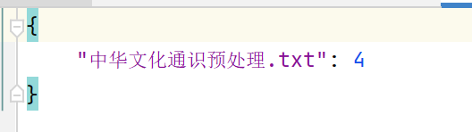
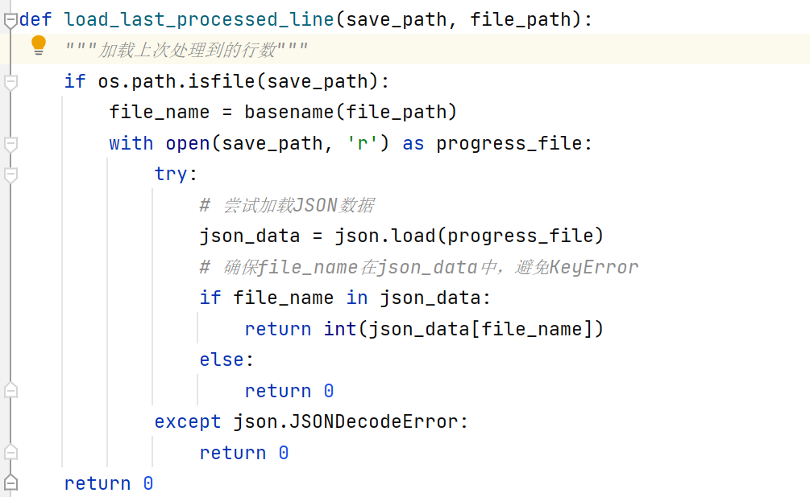
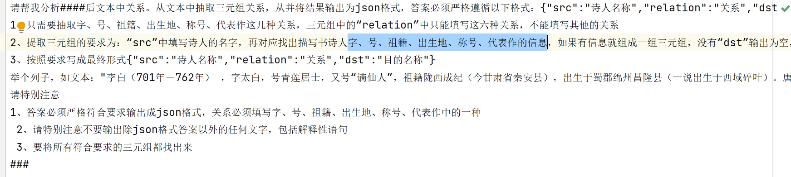
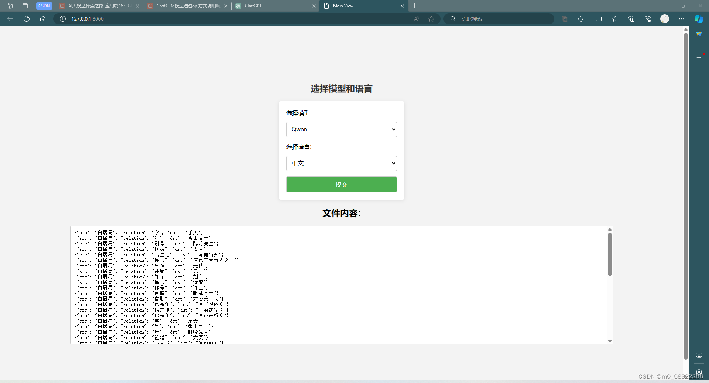
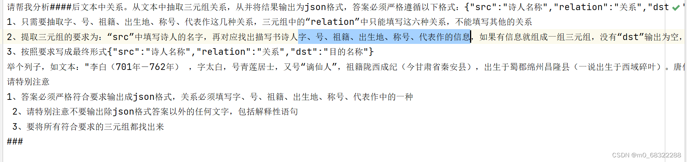
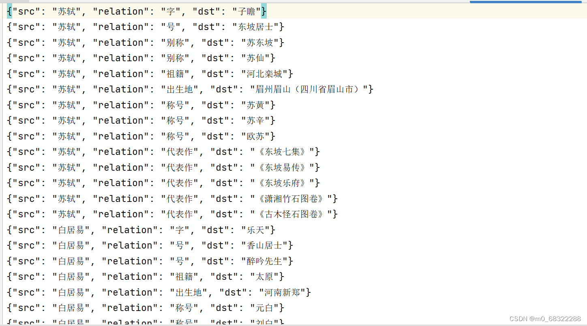

**Languages: [English](README_en.md)|[中文](README.md)**

# Task basic requirements (each ⭐️=10 points) :

1. [Remote LLM test ⭐️⭐️] Prepare no less than 3 examples and test them on the remote large model.
2. [Local LLM test effect ⭐️⭐️] Prepare no less than 3 examples (keep the same as above) and test them on the local large model.
3. [Local LLM deployment ⭐️] Check whether the large LLM model is deployed locally
4. [Local LLM application development ⭐⭐️⭐️] Whether the selected large model and task have been encapsulated into a code that can be directly called (to achieve batch input, batch output, error and exception management, etc., need to prepare a large amount of test data)
5. [documentation ⭐️⭐️] Each team must submit this assignment as Github/Gitlab project, where Readme.md is the documentation of this experiment report.

## Model deployment (deploying ChatGLM3-6B-int4 on WSL)

### Work environment
Using Windows 11:

- Ubuntu: 20.04
- nvidia cuda driver: 552.22
- CUDA: 12.4
- docker: v20.10.10

The graphics card driver must be adapted to the local CUDA version: <br>
[nvidia graphics driver](https://www.nvidia.cn/geforce/drivers/) <br>
[AMD graphics driver](https://www.amd.com/zh-cn/support/download/drivers.html)


### Install WSL
Open PowerShell or Windows command prompt in administrator mode by right-clicking and selecting "Run as Administrator" and typing:
~~~
wsl --install
~~~
After the process of installing a Linux distribution using WSL is complete, restart your computer, and then open the distribution (Ubuntu by default) using the Start menu, you need to create a user account and password for the newly installed Linux distribution. <br>
(Note that nothing appears on the screen when you enter your password, this is called blind typing) <br>
Once a User name and password are created, the account will be the default user for the distribution and will be automatically logged in at startup, and this account will be treated as a Linux administrator and will be able to run sudo (Super User Do) administrative commands.

Use the distribution's preferred package manager to regularly update and upgrade packages:
~~~
sudo apt update && sudo apt upgrade
~~~

### Install VS Code
Visit the VS Code official installation page
[VS Code official download](https://code.visualstudio.com/download)<br>
Note: Install Visual Studio Code on Windows, not in the WSL file system.

Install "WSL extension" in VS Code, you can directly search for plug-ins in VS Code to install, Can also go to the official Marketplace installed [Marketplace](https://marketplace.visualstudio.com/items?itemName=ms-vscode-remote.remote-wsl)

By using the VS Code shortcut ```CTRL+SHIFT+P``` to bring up the Command panel and then type WSL, you will see a list of available options and you can open folders in a WSL session

### Install anaconda
Download anaconda
Using our installed version 2024.02 as an example, enter in the WSL terminal:
~~~
Wget HTTP: / / https://repo.anaconda.com/archive/Anaconda3-2024.02-1-Linux-x86_64.sh
~~~
If you feel that wget download is slow, you can directly download the Linux version of the Installer on Windows, and then cd to the download directory, install it
[Anaconda official download](https://www.anaconda.com/download/success)
<br><br>
To install anaconda, you do not need to change the configuration during the installation. You can press q to skip some protocols (no one will read them anyway), and enter yes if necessary:
~~~
bash Anaconda3-2024.02-1-Linux-x86_64.sh
~~~

Open the environment variables file, change the environment variables (replace the user name with your own user name), update the environment variables: <br>
~~~
vim ~/.bashrc
~~~
~~~
export PATH="/home/ user name /anaconda3/bin:$PATH"
~~~
~~~
source ~/.bashrc
~~~

To verify, type in the WSL terminal:
~~~
conda --version
~~~

Create and activate virtual environments:
~~~
conda create Indicates the name of the virtual environment
~~~
~~~
conda activate Indicates the name of the virtual environment
~~~
If the corresponding "(virtual environment name)" appears before the user name, it indicates that the installation has been successful and activated (subsequent installation operations will operate in this environment by default).

### Install CUDA
The corresponding CUDA version installed in WSL and native <br>
First, after opening PowerShell or Windows command prompt, type to view native CUDA version:
~~~
nvidia-smi
~~~
Visit the official download website
[CUDA official download](https://developer.nvidia.com/cuda-downloads) <br>
(We'll use the latest version 12.4 as an example; see the rest
[CUDA history version download](https://developer.nvidia.com/cuda-toolkit-archive?spm=5176.28103460.0.0.297c3da2OamhJ1)
)
<br>
Select in turn:
- (Operating System) : Linux
- (Architecture) : x86_64
- (Distribution) : Ubuntu
- (Version) : 20.04
- (Installer Type) : deb(local)"

Then, according to the Installation Instructions given below (12.4 version of the Installation Instructions shown below), enter them in order in the WSL terminal:
~~~
wget https://developer.download.nvidia.com/compute/cuda/repos/ubuntu2004/x86_64/cuda-ubuntu2004.pin
sudo mv cuda-ubuntu2004.pin /etc/apt/preferences.d/cuda-repository-pin-600
wget  https://developer.download.nvidia.com/compute/cuda/12.4.1/local_installers/cuda-repo-ubuntu2004-12-4-local_12.4.1-550.54 .15-1_amd64.deb
sudo dpkg -i cuda-repo-ubuntu2004-12-4-local_12.4.1-550.54.15-1_amd64.deb
sudo cp /var/cuda-repo-ubuntu2004-12-4-local/cuda-*-keyring.gpg /usr/share/keyrings/
sudo apt-get update
sudo apt-get -y install cuda-toolkit-12-4
sudo cp /var/cuda-repo-ubuntu2004-12-4-local/cuda-*-keyring.gpg /usr/share/keyrings/
~~~
Test this by typing:
~~~
nvidia-smi
~~~
If the CUDA Version is displayed normally, the installation is successful.

### Install Pytorch
Please install PyTorch for CUDA version. <br>
If the CUDA version is larger than the maximum version supported by PyTorch, the maximum version is selected. Here we use CUDA version 12.4 as an example
[Pytorch History Download](https://pytorch.org/get-started/previous-versions/)<br>
~~~
pip3 install torch torchvision torchaudio --index-url https://download.pytorch.org/whl/cu121
~~~
To test this, enter in sequence in the WSL console:
- python
- import torch
- print(torch.__version__)
- print(f"{torch.cuda.is_available() = }")

If the output is as follows, the installation is correct:
> 2.3.0 + cu121 <br>
>torch.cuda.is_available() = True

### Deploy chatglm3-6b-int4

Download ChatGLM3 from [making](https://github.com/THUDM/ChatGLM3) model warehouse:
~~~
git clone https://github.com/THUDM/ChatGLM3
~~~
In the project directory, install the dependencies required for the model:
~~~
pip install -r requirements.txt
~~~
Create a new folder, and then clone from the [Modelscope](https://www.modelscope.cn/ZhipuAI/chatglm3-6b.git) corresponding to the model:
~~~
mkdir THUDM
~~~
~~~
cd THUDM
~~~
~~~
git lfs install
~~~
~~~
git clone https://www.modelscope.cn/ZhipuAI/chatglm3-6b.git
~~~
~~~
cd ChatGLM3
~~~

It is also possible to clone the corresponding model from elsewhere: <br>
[HuggingFace](https://huggingface.co/THUDM/chatglm-6b-int4)
(Scientific Internet is required) <br>
[OpenXLab](https://openxlab.org.cn/models/detail/THUDM/chatglm3-6b)<br>
[beginning think AI](https://www.wisemodel.cn/models/ZhipuAI/chatglm3-6b)


Test the code and replace the model path with the corresponding model path, such as "THUDM/ChatGLM3" :
~~~
from transformers import AutoTokenizer, AutoModel
tokenizer = AutoTokenizer.from_pretrained(Model path, >trust_remote_code=True)
model = AutoModel.from_pretrained(model path, >trust_remote_code=True).half().cuda()
response, history = model.chat(tokenizer, "Hello ")
print(response)
~~~

If the following output is displayed, it is successfully installed to the local computer
> Hello 👋! I'm AI assistant ChatGLM-6B, nice to meet you, please ask me any questions.


## Solution logic

We completed all the task requirements, that is, completed the layout of the front and back end, and realized the encapsulation into a code that can be directly called (to achieve batch input, batch output, error and exception management, etc., need to prepare a large number of test data).
### argparser configuration parameter usage method
We encapsulated the qwen model and glm model in the form of http, first run qwen_predict.py, and then set parameters to run qwen.py. The parameters can be selected from qwen/glm and en/ en. Corresponding to the Qianwen large model /chatglm3-6b and Chinese prompt/ English prompt respectively.


### Function implementation
Batch read output is implemented through files,

Breakpoint continuation is done by recording the number of lines of the last sentence of the code run and storing it in the last_line.json file
The file records the number of lines processed for each file and loads the last number of lines processed if the same file is processed the next time.

If the file to be processed has been processed before, the last processed line is loaded, otherwise 0 is returned
Then the next time to load directly load the last run sentence can be.

In the program, we will store the statements that cannot be handled by exceptions and the statements that cannot be extracted into the error_data.txt file, which will be read again after processing all the contents
error_data.txt(Note: In the future, a carriage return symbol can be stored in the abnormal sentence to occupy the space, record the number and content of the abnormal sentence, and finally, after unified processing, if the sentence can be processed, it will be re-stored in the corresponding line) file for further processing. If it still fails, it will be stored in the error_data.txt again.

Anomaly detection using try... except statement implementation.
### Results show
The extracted results are shown in the figure below. We use regular expressions on the original text to process and then write to the file

prompt in both English and Chinese as shown below (Chinese only)

The final front and rear interface styles are as follows.


### Task test
In the final task, we selected 100 poets' information, and then used prompt to extract the poet's word, number, ancestral home, birthplace, title, and representative information. The Chinese prompt is shown in the picture


Extract the final sample as shown in the figure



## Run the project

### Project directory structure
~~~
NLP/
├── chatglm_6b_int4_model/
│   ├── config.json
│   ├── pytorch_model.bin
│   ├── quantization.py
│   ├── configuration_chatglm.py
│   ├── ice_text.model
│   ├── quantization_kernels_parallel.c
│   ├── tokenizer_config.json
│   ├── modeling_chatglm.py
│   ├── quantization_kernels.c
│   └── tokenization_chatglm.py
├── data/
│   ├── data.txt
│   ├── error_data.txt
│   └── prompt/
│       ├── prompt_en.txt
│       └── prompt_zh.txt
├── PromptProject/
│   ├── PromptProject
│   │   ├── settings.py
│   │   └── urls.py
│   ├── Test/
│   │   ├── templates
│   │   │   └── main.html
│   │   ├── apps.py
│   │   ├── urls.py
│   │   └── views.py
│   └── manage.py
├── result/
│   ├── glm_result_zh.txt
│   ├── glm_result_en.txt
│   ├── qwen_result_zh.txt
│   ├── qwen_result_en.txt
│   └── log/
│       ├── app.log
│       └── last_line.json
├── readme_imgs/
│   ├── image_1.png
│   ├──...
│   └── image_11.png
├── README.md
├── requirements.txt
├── main.py
└── client.py
~~~

### Project run
Just modify the root_path variable in main.py and change it to your current root directory
(If the location of the model file is different, you must also modify the model_path variable in client.py), such as:
>root_path = "/home/bfeoe/NLP/"

>model_path = "chatglm_6b_int4_model"

First obtain a qwen model API from Alibaba Cloud, and Alibaba Cloud gives away 3 million tokens for free
[asked ali cloud thousand API](https://help.aliyun.com/zh/dashscope/developer-reference/api-details)
dashscope.api_key variable in client.py.

### Command line execution

First, run the client.py file:
~~~
python client.py
~~~
(If the port is occupied, just modify the port value at the end)

Then you can start the task:
~~~
python main.py --model ["qwen", "glm"] --language ["zh", "en"] --data_path "File path"
~~~

### Web side

First, run the client.py file, the same as the command line execution:
~~~
python client.py
~~~

Then, go to the PromptProject directory and start the server:
~~~
cd PromptProject
~~~
~~~
python manage.py runserver
~~~

### Other information

log information is stored in the file result/log/app.log <br>
The result of the code is moved to the file {model}_result_{language}.txt file to view <br>
If any error data is reported, it is extracted separately and stored in the data/error_data.txt file <br>
